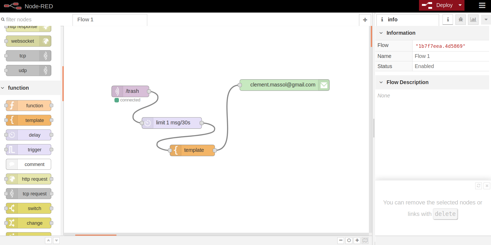

# SMART-TRASH
Ce projet à été réalisé par [@WiLDCaT](https://github.com/wildcat7534); [@OlgaBd](https://github.com/olgaBd)

## VIDEO
![photo: ] https://youtu.be/WfB8pfKr62g)

## BIBLIOTHEQUE UTILISEE
+ HCSR04.h
+ WiFi.h
+ Adafruit_MQTT.h
+ Adafruit_MQTT_Client.h
+ uTimerLib.h

## MATERIE
- Bread Bord
- Carte ESP32
- Capteur De Proximité (HC-SR04)

## SCHEMA ELECTRIQUE

## NODE-RED

